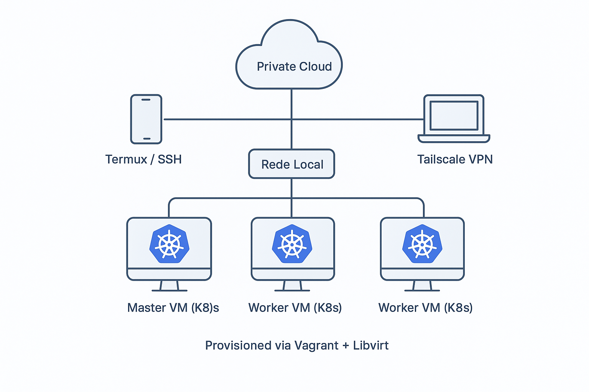

# Home Lab para Estudos LFCS & CKA com Vagrant e KVM/Libvirt

Este repositório documenta a criação e automação do meu laboratório de estudos para as certificações **Linux Foundation Certified Sysadmin (LFCS)** e **Certified Kubernetes Administrator (CKA)**.

O objetivo é ter um ambiente multi-nó de Kubernetes robusto, acessível de qualquer lugar e provisionado com práticas de Infraestrutura como Código (IaC), sem depender de provedores de nuvem.

### Arquitetura do Laboratório



### 🚀 Tecnologias Utilizadas

* **Virtualização:** KVM/QEMU com Libvirt
* **Automação (IaC):** Vagrant
* **Sistema Operacional (VMs):** Ubuntu Server 22.04
* **Orquestração:** Kubernetes (K8s) instalado via Kubeadm
* **Acesso Remoto Seguro:** Tailscale (VPN Mesh)

### 📋 Pré-requisitos (Para replicar o ambiente)

Para executar este laboratório em sua própria máquina (Debian/Ubuntu), siga o [guia de instalação e configuração do ambiente](./docs/SETUP_HOST.md).

### 🚀 Como Utilizar

Após configurar os pré-requisitos no seu host, basta clonar o repositório e iniciar o ambiente com um único comando:

```bash
# Clone o repositório
git clone [https://github.com/taciosouzaoliveira/homelab-lfcs-cka.git](https://github.com/taciosouzaoliveira/homelab-lfcs-cka.git)
cd homelab-lfcs-cka

# Inicie o cluster Kubernetes
vagrant up
